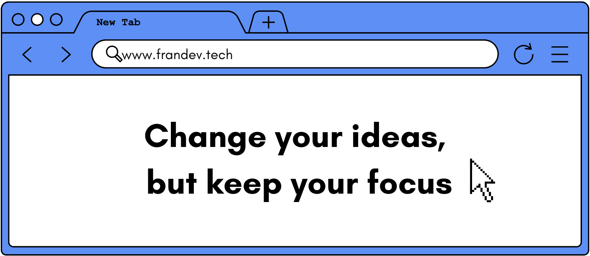
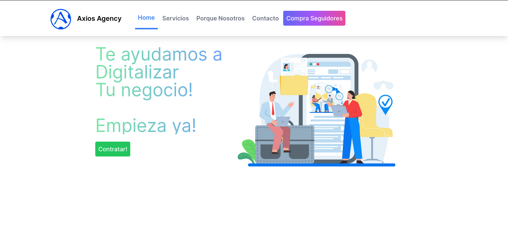
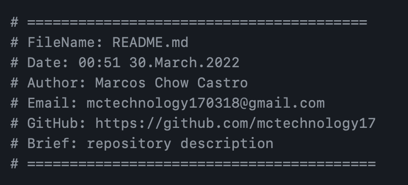

<h1 align="center">I'm there  Francisco Palencia - Frontend Developer🚀</h1>

<table align="right">
<tr>
<td>

[][linkedin]
[][whatsapp]
[][instagram]
[][facebook]

</td>
</tr>
</table>

  
🇨🇴 About me!

### 👏 Computer programming and analysis technician💻!!
- 🦾 I love the PowerLifting!
- 🤓  I’m currently learning python
- 👾  I am very curious and that is why you start studying programming
- 🗒  Passionate about the frontend.

 

---

<h3 align="center"> Latest Projects</h3>

<tr>
<td>

[][gm]

</td>
<td> <h4 align="left"> <a href="https://github.com/francisco-programmer/axios-agency" target="_blank"><code>Axios Agency Marketing Digital</code></a> </h4>
  

    
see more...

   Web Development Services, Social Media, Seo 

  
 </td>
</tr>
<tr>
<td>

</td>

<td> <h4 align="left"> <a href="https://github.com/francisco-programmer/clinfra" target="_blank"><code>🌅Clinfra</code></a> </h4>
  

    
see more...

    App with REACT  to see the weather and climate of all cities in the world

  
 </td>
</tr>
<tr>
<td>

[][vimtools]

</td>
<td> <h4 align="left"> <a href="https://github.com/francisco-programmer/newportafolio" target="_blank"><code>Porfolio</code></a> </h4>
  

    
see more...

    My personal website where my information is in case you want to work with me

  
 </td>
</tr>

 
 

---

<h3 align="center"> Languages and Tools</h3>

   
   
   
   
   
   
   
   
   
   
   
   
   
   
  
   
  
  
  
  
  
  
  
  

---

---

<h3 align="left"> GitHub Stats</h3>

  <a href="https://github.com/francisco-programmer">
  
  

---

### 🏆 GitHub Profile Trophy

[linkedin]: https://www.linkedin.com/in/francisco-palencia/
[whatsapp]: https://wa.me/+573015984814
[instagram]: https://www.instagram.com/franciscopalencia14/
[facebook]: https://m.facebook.com/cicotupapa/

[vimtools]: https://github.com/francisco-programmer/newportafolio
[jailbreakrepo]: https://mctechnology17.github.io/
[uiglitch]: https://repo.packix.com/package/com.mctechnology.uiglitch/
[uiswitches]: https://repo.packix.com/package/com.mctechnology.uiswitches/
[gm]: https://github.com/mctechnology17/gm
[youtuberepo]: https://github.com/mctechnology17/youtube_repo_mc_technology
